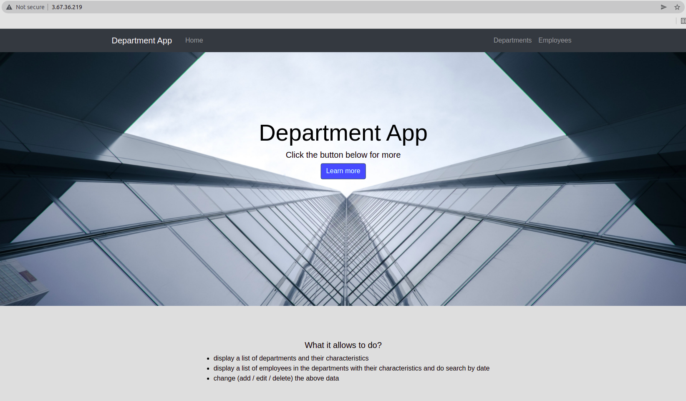

# Department Management Application

The project provides Web Service (RESTful) for CRUD operations and Web Application for managing departments 
and employees which uses aforementioned web service for storing and reading data
from database.

The web application allows:
1. display a list of departments and the average salary (calculated automatically) for these departments;
2. display a list of employees in the departments with an indication of the salary for each employee and a search field to search for employees born on a certain date or in the period between dates;
3. change (add / edit / delete) the above data.

## Install

1. Create a local copy of the project with a command:
```
git clone git@github.com:YuliaHrabovenko/department_management_project.git
```
2. Enter department_management_project directory
```
cd department_management_project
```
3. Create a virtual environment in the department_management_project directory
```
python3 -m venv department_management_project/venv
```
4. Activate your virtual environment
```
source venv/bin/activate
```
5. Install required packages 
```
pip install -r requirements.txt
```
6. Install and configure a MySQL database
```
sudo apt update && sudo apt upgrade -y 
sudo apt install mysql-server
sudo mysql
CREATE USER 'your_mysql_user'@'localhost' IDENTIFIED BY 'password';
GRANT ALL PRIVILEGES ON *.* TO 'your_mysql_user'@'localhost' WITH GRANT OPTION;
exit
mysql -u [your_username] -p
CREATE DATABASE [your_database_name];
```
7. Create .env file in the project directory and set the following environment variables:
```
MYSQL_USER="your_mysql_user"
MYSQL_PASSWORD="your_mysql_password"
MYSQL_SERVER="localhost"
MYSQL_DATABASE="your_mysql_name"
```
8. Apply the migration to the database:
```
flask db upgrade
```
9. Run the project locally with the command:
```
export FLASK_APP=app
flask run
```
## Now you should have access to the web service and web application:
### Web Service addresses
```
http://127.0.0.1:5000/api/departments
http://127.0.0.1:5000/api/departments/<uuid>
http://127.0.0.1:5000/api/employees
http://127.0.0.1:5000/api/employees/<uuid>
http://127.0.0.1:5000/api/employees/search
```
### Web Application addresses
```
http://127.0.0.1:5000/
http://127.0.0.1:5000/departments
http://127.0.0.1:5000/edit_department/<uuid>
http://127.0.0.1:5000/employees
http://127.0.0.1:5000/edit_employee/<uuid>
```
## Deploy the application to an AWS EC2 instance
In order to deploy this application to an AWS EC2 instance you should:
* create EC2 Instance in AWS with Ubuntu LTS;
* repeat steps described above and configure Gunicorn as a WSGI server to communicate
with the flask application and Nginx as a proxy server between the Gunicorn server and the
client with the help of url for instructions given below:
```
https://www.youtube.com/watch?v=goToXTC96Co&t=2121s
```
As a result, your application will become publicly accessible via your IP address:


<figcaption>Pic. 1.1 Deployed app image</figcaption>
