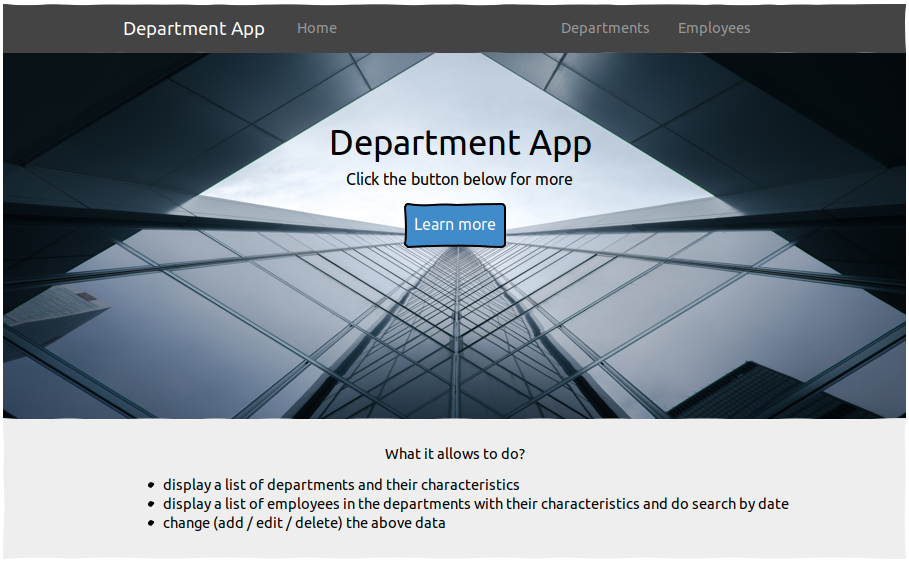
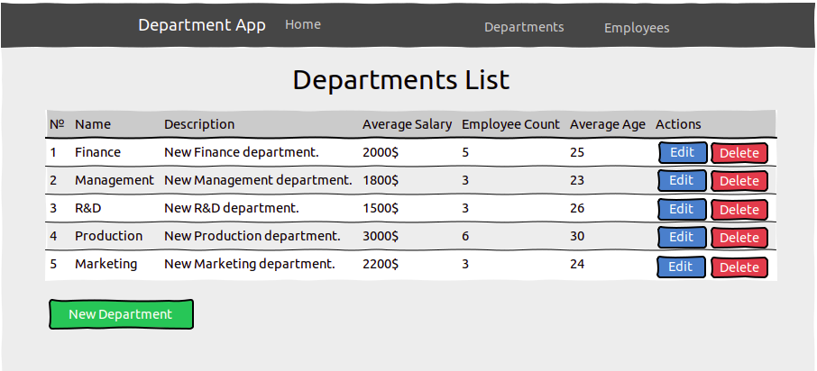
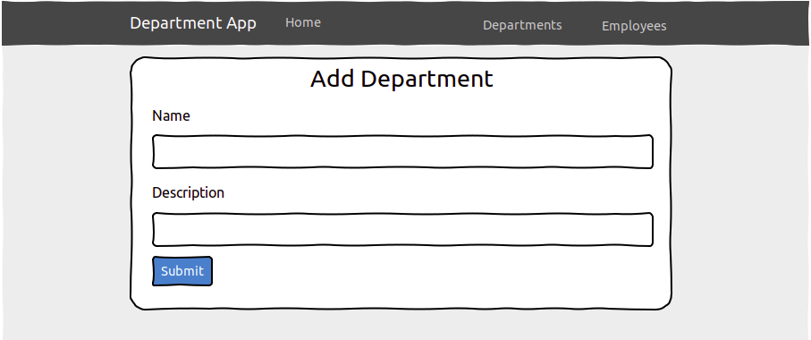
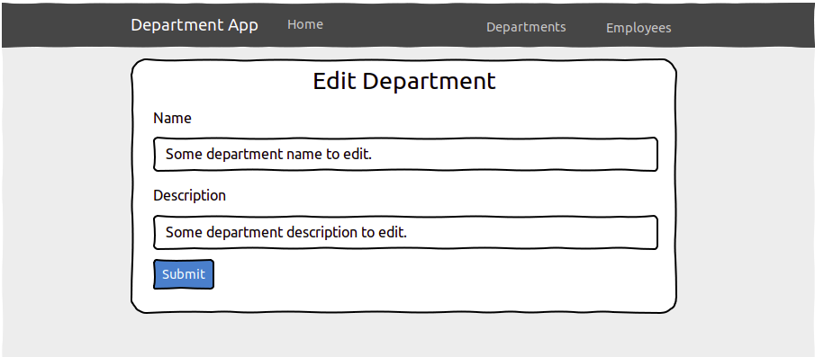
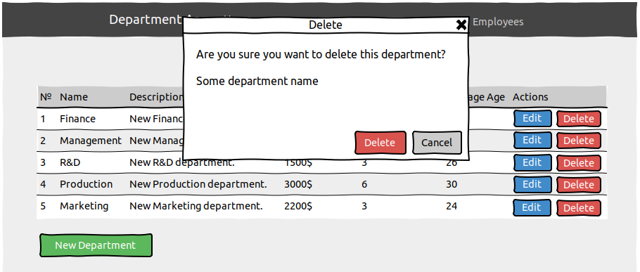
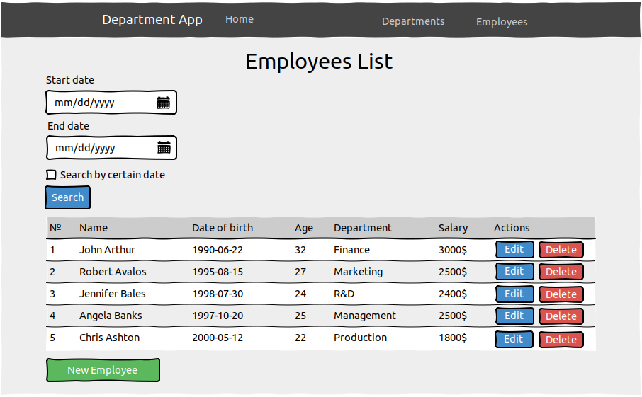
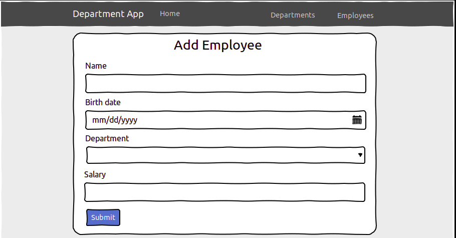
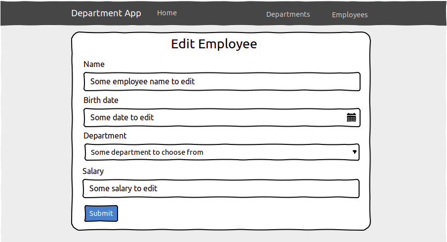
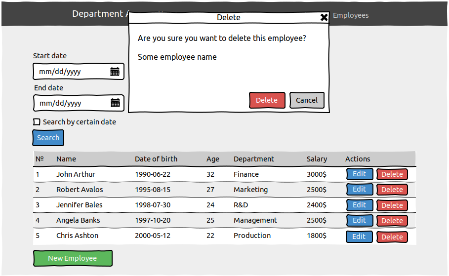

# Department App

### Vision

*“Department App”* is web-application which allows users to record information about departments and employees.

Application should provide:

* Storing departments and employees in a database;
* Display a list of departments and the average salary, employee count and average age (calculated automatically) for these departments;
* Updating the list of departments (adding, editing,removing);
* Display a list of employees in the departments with an indication of the name,  salary, date of birth, age, department name for each employee;
* Updating the list of employees (adding, editing,removing);
* Filtering by a certain date for employees;
* Filtering by the period between dates for employees;

### 1. Home page

***Main scenario:***

* User selects *“Home”* menu item;
* Application displays home page.

<figcaption>Pic. 1.1 View the Home page.</figcaption>

### 2. Departments

#### 2.1 Display list of departments

The mode is designed to view the list of departments.

***Main scenario:***

* User selects menu item *“Departments”*;
* Application displays list of departments.

<figcaption>Pic. 2.1 View the Departments list.</figcaption>

The list displays the following columns:

* № - number of the departments in the list;
* Name – unique department name;
* Description – department description;
* Average Salary – average salary for employees working in the department;
* Employee Count – amount of the employees in the department;
* Average Age - average age of the employees working in the department.

#### 2.2 Add department

***Main scenario:***

* User clicks the *“New department”* button in the departments list view mode;
* Application redirects user to the page with the form “Add department” to enter department data;
* User enters department data and presses *“Submit”* button;
* If entered data is valid, then record is added to database;
* If error occurs, then error message is displayed;
* If a new department record is successfully added, then list of departments with added records is displayed.

<figcaption>Pic. 2.2 Add department.</figcaption>

When adding a department, the following details are entered:

* Name – name of a new department;
* Description – department description.

Constrains for data validation:

* Name – maximum length of 20 characters;
* Description – maximum length of 120 characters.

#### 2.3 Edit department

***Main scenario:***

* User clicks the *“Edit”* button in the departments list view mode;
* Application redirects user to the page with the form *“Edit department”* to enter department data;
* User enters department data and presses *“Submit”* button;
* If entered data is valid, then record is added to database;
* If error occurs, then error message is displayed;
* If a new department record is successfully added, then list of departments with added records is displayed.

<figcaption>Pic. 2.3 Edit department.</figcaption>

When editing a department, the following details are entered:

* Name – name of the department;
* Description – department description.

Constrains for data validation:

* Name – maximum length of 20 characters;
* Description – maximum length of 120 characters.

#### 2.4 Delete department

***Main scenario:***

* User clicks the *“Delete”* button in the departments list view mode;
* Application displays confirmation dialog *“Are you sure you want to delete this department?”*;
* The user confirms the removal of the department;
* Record is deleted from the database;
* If error occurs, then error message is displayed;
* If the department record is successfully deleted, then list of departments without deleted records is displayed. 

***Cancel scenario:***

* User clicks the *“Delete”* button in the departments list view mode;
* Confirmation dialog is displayed;
* The user presses *“Cancel”* button;
* List of departments without changes is displayed.

<figcaption>Pic. 2.4 Delete department dialog.</figcaption>

### 3. Employees

#### 3.1 Display list of employees

The mode is designed to view the list of employees.

***Main scenario:***

* User selects menu item *“Employees”*;
* Application displays list of employees.

<figcaption>Pic. 3.1 View the employees list.</figcaption>

The list displays the following columns:

* № - number of the employees in the list;
* Name – unique employee name;
* Date of birth – employee's  date of birth;
* Age – automatically calculated value of employee's age;
* Department – name of the department an employee works in;
* Salary – employee's salary.

***Filtering by date:***

* In the employees list view mode, the user chooses a search mode by clicking the *“Search by certain date”* checkbox;
* User enters search data and clicks on the *“Search”* button;
* Application displays updated list of employees based on provided data.

#### 3.2 Add employee

***Main scenario:***

* User clicks the *“New employee”* button in the employees list view mode;
* Application redirects user to the page with the form *“Add employee”* to enter employee's data;
* User enters employee's data and presses *“Submit”* button;
* If entered data is valid, then record is added to database;
* If error occurs, then error message is displayed;
* If a new employee's record is successfully added, then list of employees with added records is displayed.

<figcaption>Pic. 3.2 Add employee.</figcaption>

When adding an employee, the following details are entered:

* Name – employee's name;
* Birth date – employee's date of birth;
* Department – name of the department an employee works in;
* Salary -  employee's salary.

Constrains for data validation:

* Name – maximum length of 25 characters;
* Department – should be chosen from existing departments names.

#### 3.3 Edit employee

***Main scenario:***

* User clicks the *“Edit”* button in the employees list view mode;
* Application redirects user to the page with the form *“Edit employee”* to enter employee's data;
* User enters employee's data and presses *“Submit”* button;
* If entered data is valid, then record is added to database;
* If error occurs, then error message is displayed;
* If a new employee's record is successfully added, then list of employees with added records is displayed.

<figcaption>Pic. 3.3 Edit employee.</figcaption>

When editing a department, the following details are entered:

* Name – employee's name;
* Birth date – employee's date of birth;
* Department – name of the department an employee works in;
* Salary -  employee's salary.

Constrains for data validation:

* Name – maximum length of 25 characters;
* Department – should be chosen from existing departments names.

#### 3.4 Delete employee

***Main scenario:***

* User clicks the *“Delete”* button in the employees list view mode;
* Application displays confirmation dialog *“Are you sure you want to delete this employee?”*;
* The user confirms the removal of the employee;
* Record is deleted from the database;
* If error occurs, then error message is displayed;
* If the employee record is successfully deleted, then list of employees without deleted records is displayed. 

***Cancel scenario:***

* User clicks the *“Delete”* button in the employees list view mode;
* Confirmation dialog is displayed;
* The user presses *“Cancel”* button;
* List of employees without changes is displayed.

<figcaption>Pic. 3.4 Delete employee dialog.</figcaption>

